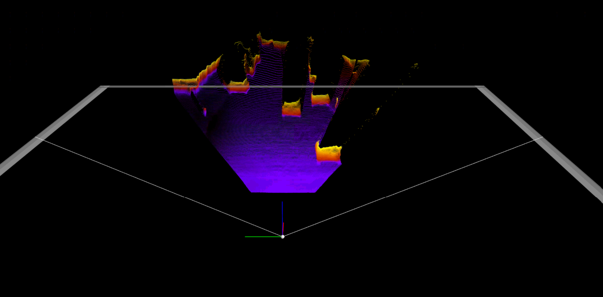

# My Pseudo-LiDARv2 based on Argo dataset

## Convert Argo dataset to Kitti format
Using to convert argo dataset to Kitti, only using the stero image data from all ring cameras.
```bash
MyPseudoLidar$ python myargostereotokittiadapter.py --all_argodata

Total number of logs: 20
#images: 83515
#lidar: 3794
working on a log c6911883-1843-3727-8eaa-41dc8cda8993
....

Total number of logs: 20
#images: 99470
#lidar: 4518
working on a log 53037376-5303-5303-5303-553038557184
....

Total number of logs: 20
#images: 85761
#lidar: 3896
working on a log e9bb51af-1112-34c2-be3e-7ebe826649b4
....
Total number of logs: 5
#images: 20110
#lidar: 914

Total number of logs: 24
#images: 110466
#lidar: 5015

```
The generated Argo Kitti format dataset is located in
```bash
MyPseudoLidar$ ls /Developer/Dataset/Argoverse/argoverse-conv-rect-all/training/
argo_kitti_link.txt  calib  image_2  image_3  label_2  train.txt  val.txt  velodyne
```
argo_kitti_link.txt file is used to track the relationship between Argo and Kitti-format data, other folders are similar to Kitti

## Before training
### Using kitti pretrained model to estimate the depth map for the argo dataset. 
Add the "pretrain=./sdn_kitti_object_trainval.pth" into "./src/configs/sdn_argo_train.config"
```bash
MyPseudoLidar$ python src/main.py -c ./src/configs/sdn_argo_train.config --generate_depth_map --dynamic_bs --data_tag Argo_test --argo
```
If using VSCode, the args are:
```bash
"args": ["-c", "./src/configs/sdn_argo_train.config", "--generate_depth_map", "--dynamic_bs", "--data_tag", "Argo_test", "--argo"],
```
The data source is "/Developer/Dataset/Argoverse/argoverse-conv-rect-mynew/training/". The estimated depth map is saved to "/Developer/3DObject/MyPseudoLidarresults/sdn_argo/depth_maps/Argo_test", All depth files are .npy from 000000.npy to 001902.npy.
Use the following code to visualize the depth map
```bash
depthimgpath='/Developer/3DObject/MyPseudoLidarresults/sdn_argo/depth_maps/Argo_test/000001.npy'
import numpy as np
img_array = np.load(depthimgpath)
#predicted depth map
from matplotlib import pyplot as plt
plt.figure(figsize=(18,15))
plt.imshow(img_array)
plt.show()
```
The depth image size is (514, 616), one sample result (000000) is


### Convert predictions to Pseudo-LiDAR and Planes
Generate Pseudo-Lidar from the depth results
```bash
MyPseudoLidar$ python ./src/preprocess/generate_lidar_from_depth.py --calib_dir /Developer/Dataset/Argoverse/argoverse-conv-rect-mynew/training/calib --depth_dir /Developer/3DObject/MyPseudoLidarresults/sdn_argo/depth_maps/Argo_test/ --save_dir /Developer/3DObject/MyPseudoLidarresults/sdn_argo/Argo_test_pseudolidar/
```
Generated Pseudo-Lidar results are saved in "/Developer/3DObject/MyPseudoLidarresults/sdn_argo/Argo_test_pseudolidar/", files are "000000.bin" to "001902.bin"

Using Mayavi to visualize the Pseudo_Lidar results, put the generated PseudoLidar results to another machine with window: /mnt/DATA5T/Argoverse/ArgoPseudoLidar/Argo_test_pseudolidar/, and run the following visualization code (--mylidarvis option is my own added option to show lidar only, --ind is the file index)
```bash
MyPseudoLidar/myVistools$ python mykitti_object.py --mylidarvis -d /mnt/DATA5T/Argoverse/ArgoPseudoLidar/Argo_test_pseudolidar/ --ind 10
```
The visualization result is


## Perform training
### generate_depth_map as the ground truth based on Lidar data
Generate disparity of ground truth run in command line 
```bash
python ./src/preprocess/generate_depth_map.py 
```
Code changes in generate_depth_map.py to replace import scipy.misc as ssc by import imageio replace image = ssc.imread(image_file) by image = imageio.imread(image_file)
The generated depth_map is under the original argo dataset folder "/Developer/Dataset/Argoverse/argoverse-conv-rect-mynew/training/depth_map". Total 001902.npy files. The npy depth file is sparse. It uses velodyne data to generate 2D depth data (other places is -1).
The following code can be used to visualize the generated depth map overlayed on top of the left image:
```bash
import cv2
import os
Basepath='/Developer/Dataset/Argoverse/argoverse-conv-rect-mynew/training/'
filename='001110.png'
image_file = path = os.path.join(Basepath, 'image_2', filename)
calibration_file = os.path.join(Basepath, 'calib', filename.replace('png', 'txt'))
label_file = os.path.join(Basepath, 'label_2', filename.replace('png', 'txt'))
img = cv2.imread(image_file)
rgb = cv2.cvtColor(img, cv2.COLOR_BGR2RGB)
img_height, img_width, img_channel = rgb.shape

import numpy as np
depthimgpath = os.path.join(Basepath, 'depth_map', filename.replace('png', 'npy'))
img_array = np.load(depthimgpath)

cmap = plt.cm.get_cmap('hsv', 256)
cmap = np.array([cmap(i) for i in range(256)])[:, :3] * 255

maxdepth=np.amax(img_array)
imgwithlidardepth=np.copy(rgb)
for i in range(img_array.shape[0]):#2056
    for j in range(img_array.shape[1]):#
        depth = img_array[i, j]
        if depth != -1:
            val=min(3*640 / depth, 255)
            #print("index i, j depth val:", i, j, depth,val)
            color = cmap[int(val), :]#640.0 different depth with different color
            cv2.circle(imgwithlidardepth, (j, i), 1, color=tuple(color), thickness=-1) #Thickness of -1 px will fill the circle shape by the specified color.
            
    
fig = plt.figure(figsize=(25, 22))
plt.imshow(imgwithlidardepth)
plt.yticks([])
plt.xticks([])
plt.show()
```
The image result is


### Start training
Using the following code the start training based on kitti pretrained model
```bash
MyPseudoLidar$ python src/main.py -c ./src/configs/sdn_argo_fulltrain.config --dynamic_bs --data_tag Argo_trainfull --argo
```
If the training is stopped, you can resume from the previous training
```bash
MyPseudoLidar$ python src/main.py -c ./src/configs/sdn_argo_fulltrain.config --dynamic_bs --resume /Developer/3DObject/MyPseudoLidarresults/sdn_argo/checkpoint_525.pth.tar --data_tag Argo_trainfull --argo

[2021-01-10 10:30:25 main.py:225] INFO     TRAIN Epoch790:0     L 2.039 RLI 4.239 RLO 0.127 ABS 0.038 SQ 0.631 DEL 0.970 DELQ 0.982 DELC 0.989
100%|████████████████████████████████████████████████████████████████████| 286/286 [08:16<00:00,  1.73s/it]
[2021-01-10 10:38:41 main.py:225] INFO     TRAIN Epoch791:0     L 2.051 RLI 4.240 RLO 0.128 ABS 0.038 SQ 0.624 DEL 0.969 DELQ 0.982 DELC 0.989
100%|████████████████████████████████████████████████████████████████████| 286/286 [08:16<00:00,  1.73s/it]
[2021-01-10 10:46:58 main.py:225] INFO     TRAIN Epoch792:0     L 2.026 RLI 4.210 RLO 0.127 ABS 0.038 SQ 0.622 DEL 0.970 DELQ 0.982 DELC 0.989
100%|████████████████████████████████████████████████████████████████████| 286/286 [08:16<00:00,  1.73s/it]
[2021-01-10 10:55:14 main.py:225] INFO     TRAIN Epoch793:0     L 2.056 RLI 4.254 RLO 0.128 ABS 0.038 SQ 0.634 DEL 0.969 DELQ 0.982 DELC 0.989
100%|████████████████████████████████████████████████████████████████████| 286/286 [08:16<00:00,  1.73s/it]
[2021-01-10 11:03:30 main.py:225] INFO     TRAIN Epoch794:0     L 2.042 RLI 4.251 RLO 0.128 ABS 0.038 SQ 0.636 DEL 0.969 DELQ 0.982 DELC 0.989
100%|████████████████████████████████████████████████████████████████████| 286/286 [08:16<00:00,  1.73s/it]
[2021-01-10 11:11:46 main.py:225] INFO     TRAIN Epoch795:0     L 2.032 RLI 4.223 RLO 0.127 ABS 0.038 SQ 0.622 DEL 0.969 DELQ 0.982 DELC 0.989
100%|████████████████████████████████████████████████████████████████████| 286/286 [08:16<00:00,  1.73s/it]
[2021-01-10 11:20:03 main.py:225] INFO     TRAIN Epoch796:0     L 2.050 RLI 4.257 RLO 0.128 ABS 0.038 SQ 0.631 DEL 0.969 DELQ 0.982 DELC 0.989
100%|████████████████████████████████████████████████████████████████████| 286/286 [08:16<00:00,  1.73s/it]
[2021-01-10 11:28:19 main.py:225] INFO     TRAIN Epoch797:0     L 2.060 RLI 4.249 RLO 0.128 ABS 0.038 SQ 0.628 DEL 0.969 DELQ 0.982 DELC 0.989
100%|████████████████████████████████████████████████████████████████████| 286/286 [08:16<00:00,  1.73s/it]
[2021-01-10 11:36:36 main.py:225] INFO     TRAIN Epoch798:0     L 2.056 RLI 4.241 RLO 0.127 ABS 0.038 SQ 0.624 DEL 0.969 DELQ 0.982 DELC 0.989
100%|████████████████████████████████████████████████████████████████████| 286/286 [08:16<00:00,  1.73s/it]
[2021-01-10 11:44:52 main.py:225] INFO     TRAIN Epoch799:0     L 2.062 RLI 4.262 RLO 0.128 ABS 0.038 SQ 0.630 DEL 0.969 DELQ 0.982 DELC 0.989
```
The final trained model is located in
```bash
$ ls /Developer/3DObject/MyPseudoLidarresults/sdn_argo
checkpoint_795.pth.tar  model_best.pth.tar
```
checkpoint_795 is the last model, available in "P100: /Developer/3DObject/MyPseudoLidarresults/sdn_argo/checkpoint_795.pth.tar"

Use the following code to check the best RMSE model
```bash
import torch
import numpy as np
import os
import glob


model_path = '/Developer/3DObject/MyPseudoLidarresults/sdn_argo/'
checkpointList = glob.glob(model_path+'/checkpoint*')

for idx, model in enumerate(checkpointList):
    checkpoint = torch.load(checkpointList[idx])
    best_RMSE = checkpoint['best_RMSE']
    checkpointname = checkpointList[idx].split('/')[-1]
    print(f'{checkpointname} checkpoint ... name {model}')
    print(best_RMSE)
```
The result looks like
```bash
checkpoint_780.pth.tar checkpoint ... name /Developer/3DObject/MyPseudoLidarresults/sdn_argo/checkpoint_780.pth.tar
tensor(4.8437)
```

## After Training
### Perform evaluation
```bash
MyPseudoLidar$ python src/main.py -c ./src/configs/sdn_argo_fulltrain.config --dynamic_bs --evaluate --data_tag Argo_trainfull --argo --resume /Developer/3DObject/MyPseudoLidarresults/sdn_argo/checkpoint_795.pth.tar
...
[2021-01-10 13:09:04 main.py:206] INFO     EVALUATE:1816        L 1.936 RLI 5.590 RLO 0.164 ABS 0.070 SQ 1.076 DEL 0.941 DELQ 0.968 DELC 0.981 Time:0.282
[2021-01-10 13:09:04 main.py:206] INFO     EVALUATE:1817        L 1.936 RLI 5.590 RLO 0.164 ABS 0.070 SQ 1.075 DEL 0.941 DELQ 0.968 DELC 0.981 Time:0.282
[2021-01-10 13:09:04 main.py:206] INFO     EVALUATE:1818        L 1.936 RLI 5.590 RLO 0.164 ABS 0.070 SQ 1.075 DEL 0.941 DELQ 0.968 DELC 0.981 Time:0.282
[2021-01-10 13:09:05 main.py:206] INFO     EVALUATE:1819        L 1.936 RLI 5.590 RLO 0.164 ABS 0.070 SQ 1.075 DEL 0.941 DELQ 0.968 DELC 0.981 Time:0.282
```
When "--evaluate" is added, the main.py will perform evaluation instead of training. One pdf figure file will be saved in the MyPseudoLidar root folder that documents all the major metrics
If using VSCode to debug the code, the args setup is
```bash
"args": ["-c", "./src/configs/sdn_argo_fulltrain.config", "--dynamic_bs", "--evaluate", "--resume", "/Developer/3DObject/MyPseudoLidarresults/sdn_argo/checkpoint_795.pth.tar", "--data_tag", "Argo_trainfull", "--argo"],
```

### Generate predicted depth map
```bash
MyPseudoLidar$ python src/main.py -c ./src/configs/sdn_argo_fulltrain.config --dynamic_bs --generate_depth_map --data_list ./split/fullargo.txt --resume /Developer/3DObject/MyPseudoLidarresults/sdn_argo/checkpoint_795.pth.tar --data_tag Argo_full --argo
```
If using VSCode, the args are
```bash
"args": ["-c", "./src/configs/sdn_argo_fulltrain.config", "--dynamic_bs", "--generate_depth_map", "--data_list", "./split/fullargo.txt", "--resume", "/Developer/3DObject/MyPseudoLidarresults/sdn_argo/checkpoint_795.pth.tar", "--data_tag", "Argo_full", "--argo"],
```
Using the trained model to predict the depth map based on the TestImgLoader (based on the ./split/fullargo.txt for all argo data), the generated depth map is: "/Developer/3DObject/MyPseudoLidarresults/sdn_argo/depth_maps/Argo_full/". All depth files are .npy from 000000.npy to 009099.npy. (Argo_trainful (particial data) has depth file to 001902.npy)
One sample (000000.npy) result is 


### Convert depth maps to Pseudo-Lidar Point Clouds
```bash
python ./src/preprocess/generate_lidar_from_depth.py \
 --calib_dir /Developer/Dataset/Argoverse/argoverse-conv-rect-all/training/calib --depth_dir /Developer/3DObject/MyPseudoLidarresults/sdn_argo/depth_maps/Argo_full/ \
 --save_dir /Developer/3DObject/MyPseudoLidarresults/sdn_argo/pseudo_lidar_Argo_full/
```
Finish Depth Finish Depth 009099.bin in "/Developer/3DObject/MyPseudoLidarresults/sdn_argo/pseudo_lidar_Argo_full/"
Visualize the Pseudo Lidar results via Mayavi
```bash
MyPseudoLidar/myVistools$ python mykitti_object.py --mylidarvis -d /mnt/DATA5T/Argoverse/ArgoPseudoLidar/pseudo_lidar_Argo_full/ --ind 10
```

Compare with the results before training, the boundaries are much better.

### Predict Ground Planes
```bash
python ./src/preprocess/kitti_process_RANSAC.py --calib_dir /Developer/Dataset/Argoverse/argoverse-conv-rect-all/training/calib \
    --lidar_dir /Developer/3DObject/MyPseudoLidarresults/sdn_argo/pseudo_lidar_Argo_full/ \
    --planes_dir /Developer/3DObject/MyPseudoLidarresults/sdn_argo/pseudo_lidar_Argo_full_planes/
```
000000.txt ~ 009099.txt are generated under pseudo_lidar_Argo_full_planes. 
The content of the plane file is like
```bash
cat /Developer/3DObject/MyPseudoLidarresults/sdn_argo/pseudo_lidar_Argo_full_planes/000001.txt
# Plane
Width 4
Height 1
1.092321e-02 -9.999349e-01 -3.290347e-03 1.635837e+00
```

### Sparsify Pseudo-LiDAR
```bash
python ./src/preprocess/kitti_sparsify_argo.py --pl_path /Developer/3DObject/MyPseudoLidarresults/sdn_argo/pseudo_lidar_Argo_full/ \
   --sparse_pl_path /Developer/3DObject/MyPseudoLidarresults/sdn_argo/pseudo_lidar_Argo_full_sparse/
```
000000.bin ~ 009099.bin are generated under pseudo_lidar_Argo_full_sparse
Visualize the sparse Pseudo Lidar via Mayavi
```bash
MyPseudoLidar/myVistools$ python mykitti_object.py --mylidarvis -d /mnt/DATA5T/Argoverse/ArgoPseudoLidar/pseudo_lidar_Argo_full_sparse/ --ind 10
```

